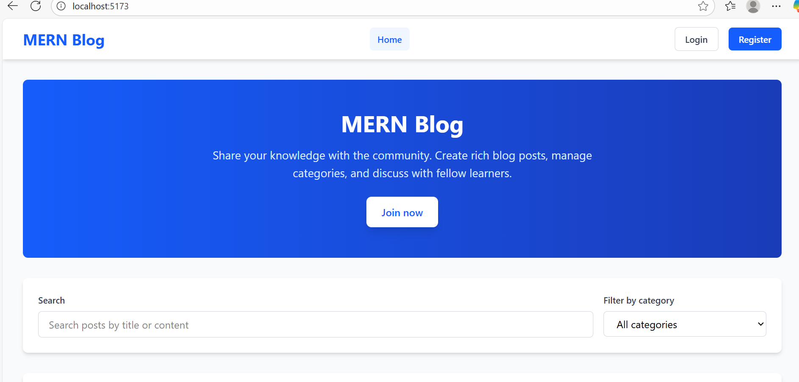
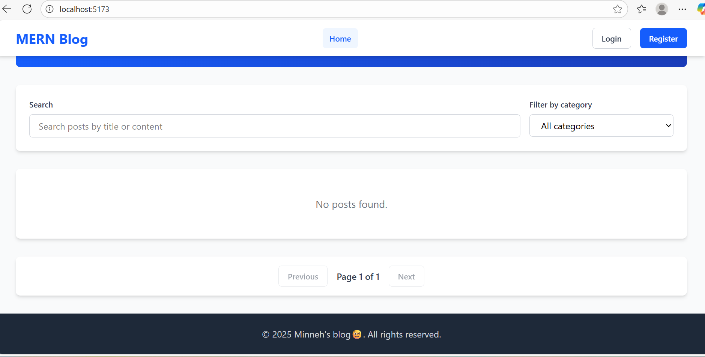
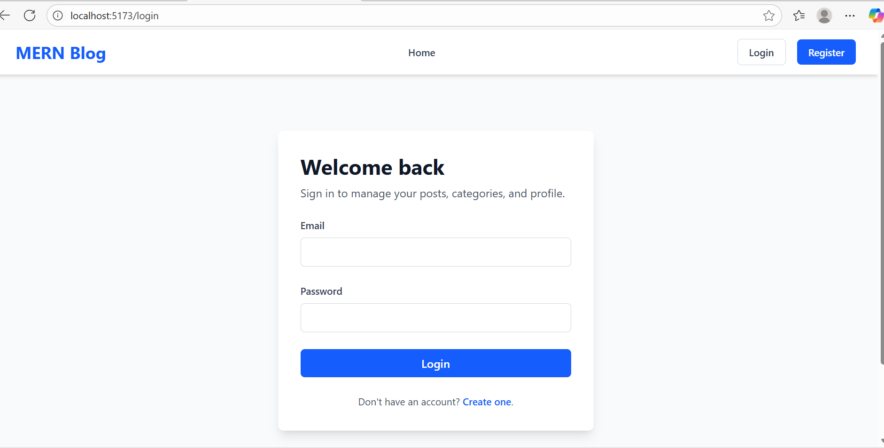
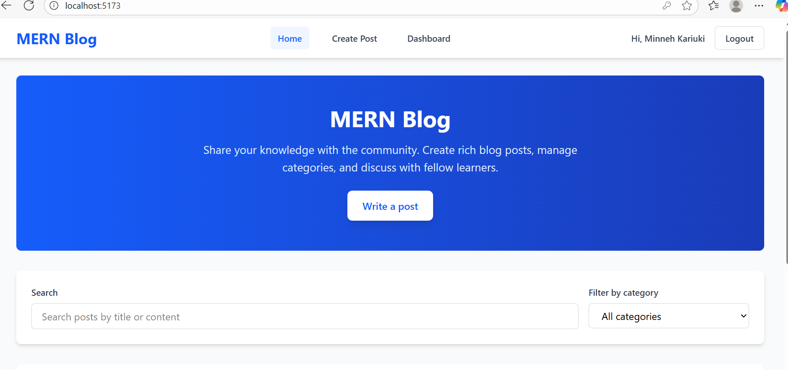
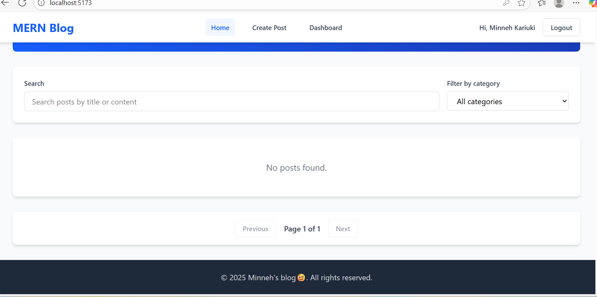
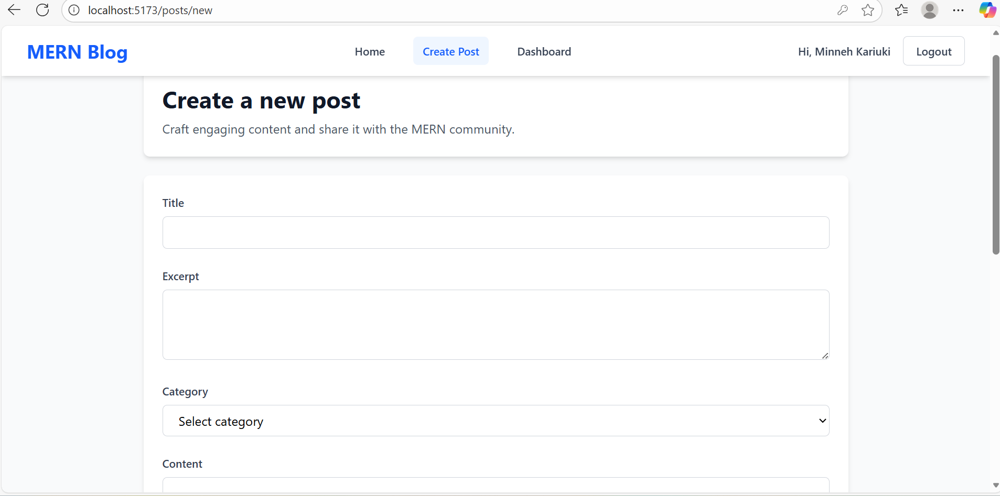
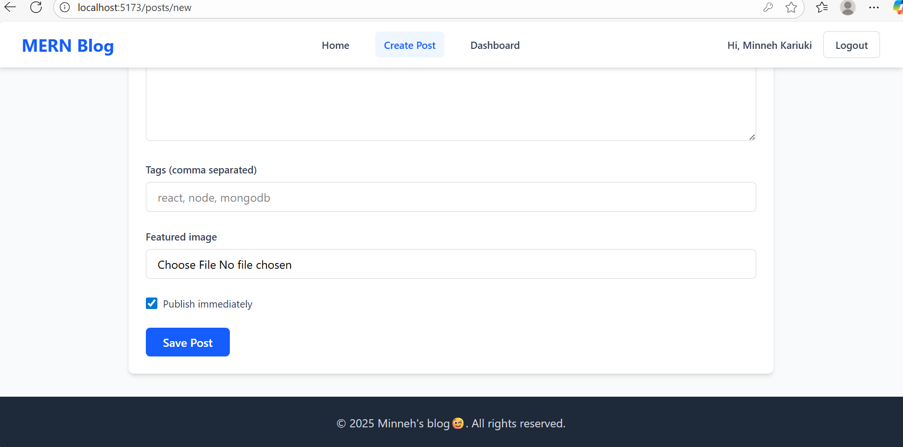
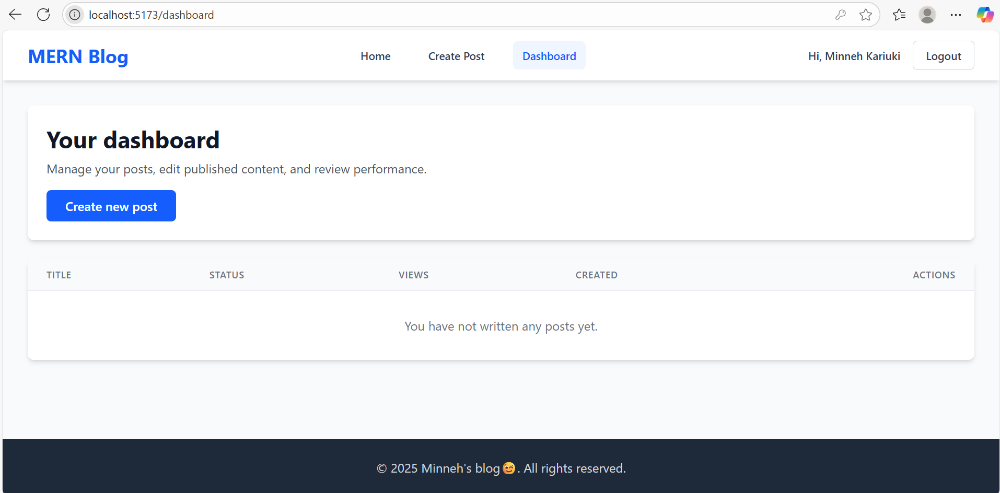

# MERN Stack Blog – Week 7 Integration Project

Build a production-ready full-stack MERN application that showcases end-to-end integration between a MongoDB/Express.js API and a Vite + React client.  
This implementation provides a complete blogging platform including authentication, file uploads, pagination, search, and commenting.

---

## 🌟 Features Completed

- Full CRUD REST API for blog posts and categories with Express 5 + Mongoose
- JWT-based authentication (register, login, session refresh, protected routes, role checks)
- React Router 7 single-page app with reusable layout, routes, and protected routes
- Context-based state management (`AuthContext`, `PostsContext`) and custom hooks
- Image uploads via Multer with automatic file serving from `/uploads`
- Client-side forms with validation, optimistic UI updates, and API error handling
- Pagination, category filtering, text search, tags, and view counter
- Comment system with authenticated posting
- Centralized error handling, request validation (express-validator), and async wrappers

---

## 🗂️ Project Structure

```
mern-stack-integration/
├── client/                         # Vite + React front-end
│   ├── env.example                 # Sample environment variables
│   ├── src/
│   │   ├── components/             # UI components (Navbar, PostCard, forms…)
│   │   ├── context/                # AuthContext & PostsContext providers
│   │   ├── hooks/                  # Custom hooks wrapping the contexts
│   │   ├── pages/                  # Route-aligned page components
│   │   ├── services/               # Axios API layer with interceptors
│   │   ├── App.jsx                 # Route definitions
│   │   └── main.jsx                # App bootstrap with providers
│   └── package.json
├── server/                         # Express + MongoDB back-end
│   ├── env.example                 # Sample environment variables
│   ├── controllers/                # Route handlers (posts, categories, auth)
│   ├── middleware/                 # Auth, validation, upload, error handling
│   ├── models/                     # Mongoose models (Post, Category, User)
│   ├── routes/                     # API route definitions
│   ├── utils/                      # AppError helper
│   ├── package.json
│   └── server.js                   # App entry point
├── Week4-Assignment.md             # Task breakdown & completion log
└── README.md                       # You are here
```

---

## ⚙️ Prerequisites

- Node.js 18+
- npm 10+
- MongoDB (local instance or Atlas cluster)
- Optional: Cloudinary/S3 bucket if you plan to offload image uploads later

---

## ⚡ Quick Start

### 1. Clone & install dependencies

```bash
git clone <your-repo-url>
cd mern-stack-integration

# Back-end
cd server
npm install

# Front-end
cd ../client
npm install
```

### 2. Configure environment variables

Copy the provided sample files and update the values for your setup:

```bash
# Back-end (.env lives beside server.js)
cd server
copy env.example .env  # Windows
# cp env.example .env   # macOS/Linux

# Front-end (root of client workspace)
cd ../client
copy env.example .env  # Windows
# cp env.example .env   # macOS/Linux
```

**Server `.env` fields**

- `PORT` – API port (default `5000`)
- `MONGODB_URI` – MongoDB connection string
- `JWT_SECRET` – strong secret for signing tokens
- `JWT_EXPIRES_IN` – token lifetime (e.g. `7d`)
- `CLIENT_URL` – URL of the React app (for CORS)

**Client `.env` fields**

- `VITE_API_URL` – Base URL pointing to the Express API (e.g. `http://localhost:5000/api`)

### 3. Run the dev servers

```bash
# API
cd server
npm run dev

# Client
cd ../client
npm run dev
```

Visit the React app at the URL reported by Vite (normally `http://localhost:5173`).

---

## 🔌 API Overview

| Method | Endpoint                     | Description                                | Auth |
|--------|-----------------------------|--------------------------------------------|------|
| GET    | `/api/posts`                | List posts (supports `page`, `limit`, `category`, `search`, `author`) | Public |
| GET    | `/api/posts/:idOrSlug`      | Read a single post, increments view count  | Public |
| POST   | `/api/posts`                | Create a post (supports image upload)      | JWT  |
| PUT    | `/api/posts/:id`            | Update a post                              | JWT  |
| DELETE | `/api/posts/:id`            | Delete a post                              | JWT  |
| POST   | `/api/posts/:id/comments`   | Add a comment                              | JWT  |
| GET    | `/api/categories`           | List categories                            | Public |
| POST   | `/api/categories`           | Create a category (admin only)             | JWT + Admin |
| POST   | `/api/auth/register`        | Register new user                          | Public |
| POST   | `/api/auth/login`           | Login and receive JWT                      | Public |
| GET    | `/api/auth/me`              | Resolve the current session                | JWT  |

All responses follow this structure:

```json
{
  "success": true,
  "data": { /* resource */ },
  "pagination": { /* optional paging meta */ }
}
```

Validation errors respond with `400` and a descriptive `message`.

---

## 🖥️ Front-End Experience

- **Home**: hero, search, category filter, paginated posts grid.
- **Post details**: featured image, rich body, tags, view count, and comments.
- **Auth flows**: register/login forms with inline validation feedback.
- **Author dashboard**: manage authored posts with edit/delete controls.
- **Create/Edit forms**: upload featured images, toggle publish status, manage tags.
- **Global UX**: optimistic updates, skeleton loaders, toasts-style alerts, and redirect on auth failures.

State is managed via context providers and custom hooks (`useAuth`, `usePosts`), keeping components declarative and testable.

## Screenshots
### Home page before login



### Login page


### Home page after login



### Create a new post page



### Dashboard page



